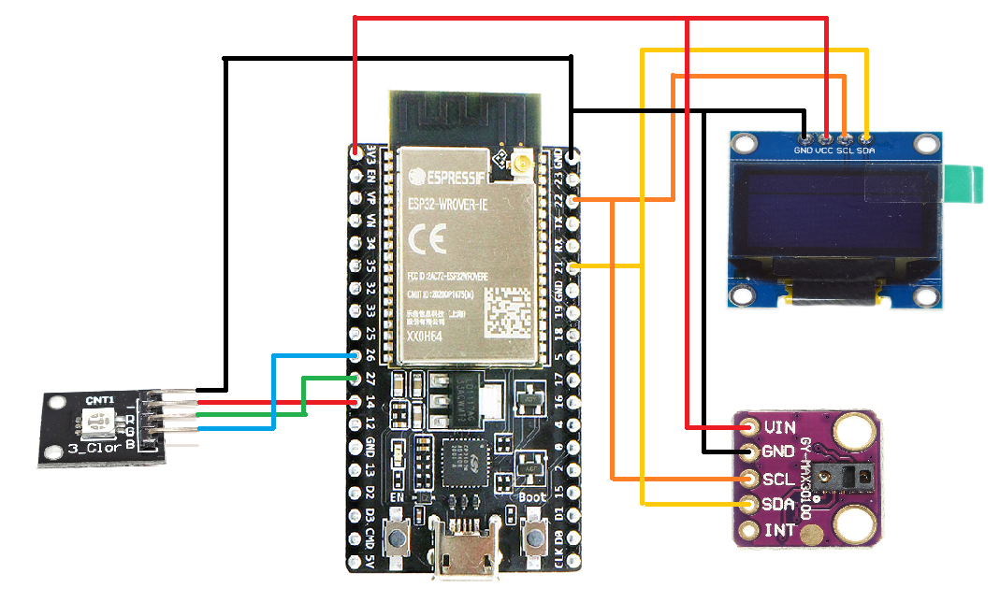

# Bài tập lớn hệ nhúng: Đo nhịp tim và nồng độ O2


## Introduction

| Author (Name)      | StudentID |
| -------------------| ----------|
| Do Duc Long        | 20215609  |
| Vu Quang Nam       | 20215622  |
| Nguyen Thanh Hai   | 20215571  |
| Vuong Kim Hoang    | 20215584  |

## Project Overview
Phát triển một hệ thống đo nhịp tim và nồng độ Oxi kết hợp đèn báo nếu bất thường.

## Prerequisites (Requirements)
Trước khi bắt đầu dự án đo nhịp tim và nồng độ oxi điều quan trọng là phải đảm bảo bạn có các thành phần và công cụ cần thiết. Làm quen với các cảm biến và module được sử dụng trong dự án này:

- ESP32: ESP32 là một bộ vi điều khiển thuộc danh mục vi điều khiển trên chip công suất thấp và tiết kiệm chi phí. Hầu hết tất cả các biến thể ESP32 đều tích hợp Bluetooth và Wi-Fi chế độ kép, làm cho nó có tính linh hoạt cao, mạnh mẽ và đáng tin cậy cho nhiều ứng dụng.

- MAX30100: Cảm biến nhịp tim và oxy trong máu MAX30100 được sử dụng để đo nhịp tim và nồng độ Oxy trong máu, thích hợp cho nhiều ứng dụng liên quan đến y sinh, cảm biến nhịp tim và oxy trong máu sử dụng phương pháp đo quang phổ biến hiện nay với thiết kế và chất liệu mắt đo chuyên biệt từ chính hãng Maxim cho độ chính xác và độ bền cao, cảm biến sử dụng giao tiếp I2C với bộ thư viện sẵn có trên Arduino rất dễ sử dụng.

- OLED 0.96": Màn hình Oled 0.96 inch giao tiếp I2C cho khả năng hiển thị đẹp, rõ nét vào ban ngày và khả năng tiết kiệm năng lượng tối đa với mức chi phí phù hợp, màn hình sử dụng giao tiếp I2C cho chất lượng đường truyền ổn định và rất dễ giao tiếp chỉ với 2 chân GPIO.

- Module RGB: Khác với LED bình thường, led RGB có 4 chân, trong đó có 1 chân dương chung và 3 chân âm riêng cho từng màu (R - red - đỏ, G - Green - Xanh lá, B - Blue - Xanh dương). LED RGB thực chất là 3 con diode led bình thường dính chụm thành 1 khối mà thôi (vì độ sáng của LED RGB khá sáng cộng với hiệu ứng lưu ảnh của mắt người mà mình thấy được các màu sắc khác nhau).

## Schematic


## Hướng dẫn sử dụng
- Bước 1: Người dùng đặt đầu ngón tay bất kỳ lên sensor MAX30100 (màu tím)

- Bước 2: Sau 3-5s thực hiện đo, người dùng quan sát giá trị nhịp tim và nồng độ Oxi trên màn hình oled

- Bước 3: Dựa vào cảnh báo đèn mọi người có thể biết nhịp tim của mình ở mức nào, đỏ tương ứng với quá cao, xanh lá là an toàn, còn xanh dương là quá thấp.

- Bước 4: Dừng đo, mọi người nhấc tay ra

- Link hướng dẫn sử dụng: [HDSD](https://www.youtube.com/watch?v=xI7QabEQ2Qc)

## Code Setup Explain

- The OLED Setup: Define the wiring SSD1306 connection
```
//  21   ---  SDA,
//  22   ---  SCL,
//  GND  ---  GND,
//  3.3V ---  VCC,
```

- The Max30100 Setup: Define the wiring Max30100 connection
```
//  21   ---  SDA,
//  22   ---  SCL,
//  GND  ---  GND,
//  3.3V ---  VCC,
```

- The Module RGB Setup: Define the writing RGB connection
```
//  14  ---  R,
//  27  ---  G,
//  26  ---  B,
//  GND ---  GND,
```


## Contributors

- [SSD1306](https://randomnerdtutorials.com/esp32-ssd1306-oled-display-arduino-ide/)

> If you have any questions or need further assistance, feel free to contact the author.